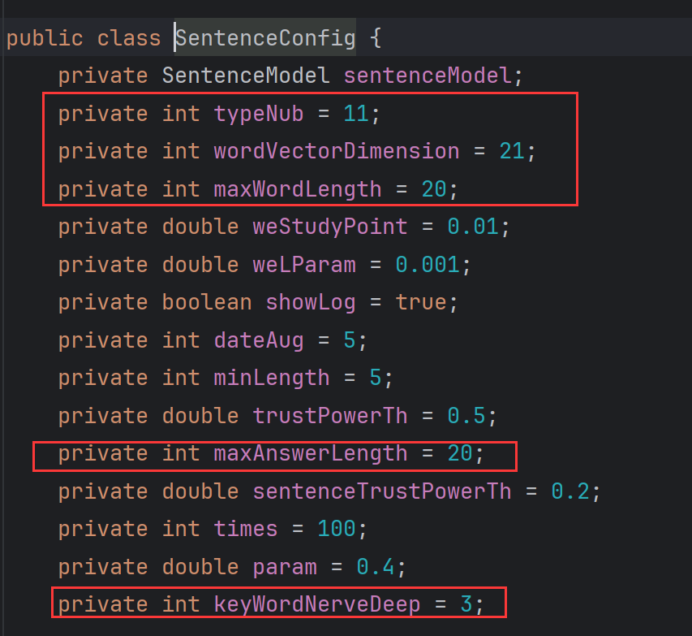
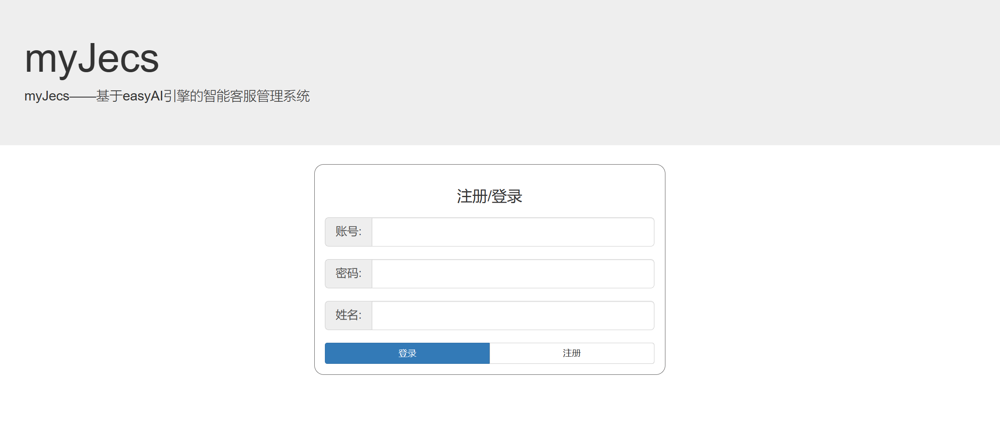
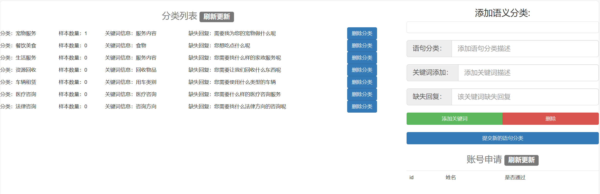
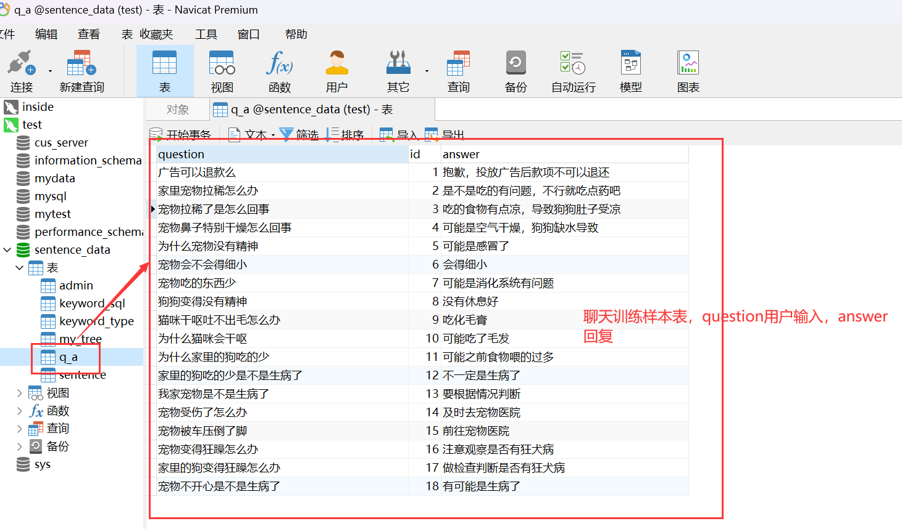
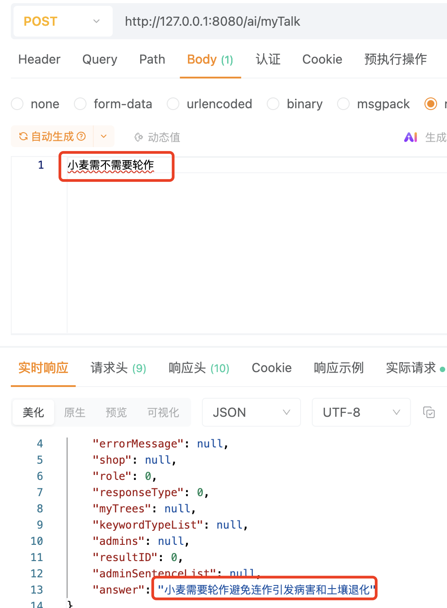
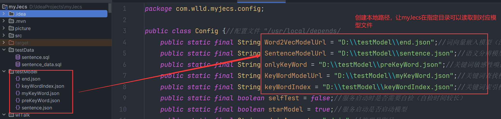
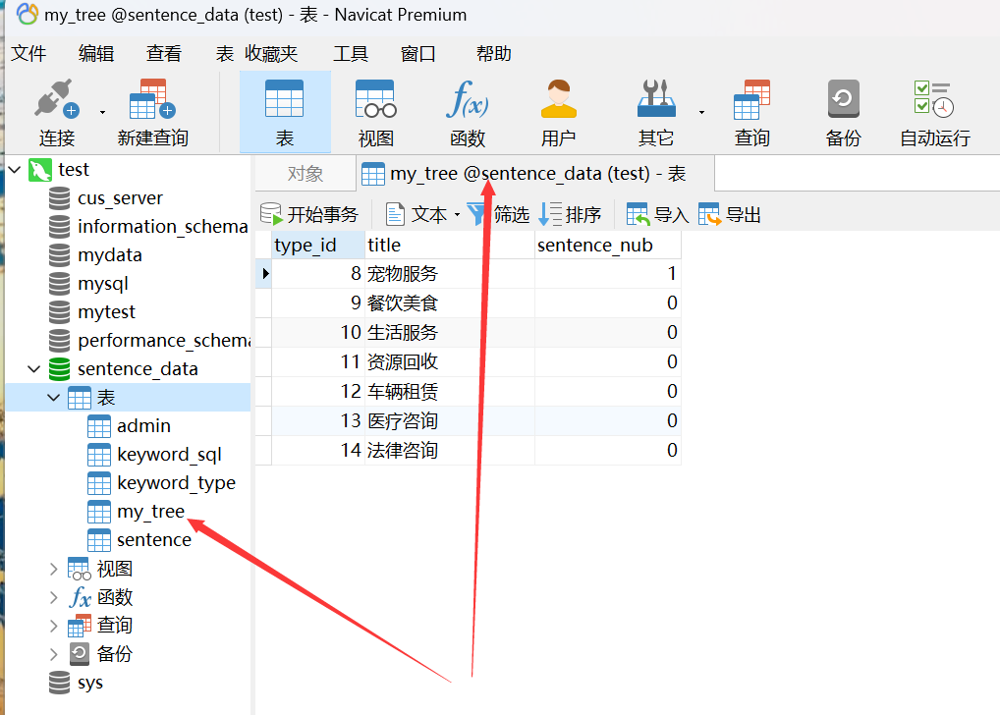

### <div align=center></div>

### 项目说明：
* 该项目是基于easyAi引擎的JAVA高性能，低成本，轻量级智能客服助手。可与用户自动对话，自动捕捉订单信息，分辨用户需求，自动生成订单，自动交互问答，轻量级的智能客服助手。
* 这是全网最快的java开源原生智能客服助手(原名myJecs，现已正式更名为SayOrder)！
* 为电商类，咨询类，平台类服务应用(web/小程序/APP/JAVA)，提供高性能的自动智能客服支持。
* 本项目是依赖easyAi引擎衍生应用，以easyAi高性能廉价部署的思路，可在cpu上无压力高效运行，开包即用。功能持续扩展，敬请期待。
* 本项目永久免费商用，如果能对您生产和学习有帮助请给作者一个star，这会非常鼓励我。
* 若有想扩充的功能或技术交流请进群提意见，加微信交流群：thenk008
* 项目依赖easyAi下载链接：https://gitee.com/dromara/easyAi (gitee)  https://github.com/lifejwang11/easyAi (github)
* 管理后台登陆地址:http://localhost:8080/
### github同步链接
https://github.com/lifejwang11/SayOrder
## 开发者常见疑问整理
> 问：为什么 /ai/myTalk 有时候返回结果不是我想要的？
>>——这是因为SQL脚本里，作者提供用来演示语句生成的训练样本数量太少，只有不到二十条，只能用作教学演示，会出现不好的回复也是很正常的。若生产使用请扩充自己的训练样本库！
***
> 问：关键词抓取是通过训练库里的关键词进行模糊匹配么？为什么我加了很多关键词却没有什么效果？
>>——并不是！关键词抓取本质是对关键词的上下文结构进行训练，训练好之后，myJecs会根据句子的构成去推理关键词所处的位置。  
>>——所以即便训练库里没有该关键词，myJecs依然可以推理出关键词的结果。
>> 如果开发者想进一步提升关键词抓取的准确性，在训练库里增加更多样的表述语句形式，丰富关键词的上下文结构才是正确选择。句型不变，单纯的替换关键词，那几乎是毫无效果的！
***
> 问：关于开发者自行修改模型为增量训练是否可行
>>——可行，但要注意以下问题，若不满足则会报错：
> 1，这五个参数与模型绑定，若增量训练该五个参数被修改，则加载老模型会报错，不可增量训练。  
> int typeNub;//语义分类种类数与表my_tree数据条数对应  
int wordVectorDimension;//语义分类词嵌入维度，该数字越大，支持的分类复杂度越高，支持数据量越多，越接近大模型，生成问答模型越稳定，但速度越慢  
int qaWordVectorDimension;//问答模型词嵌入维度，该数字越大速度越慢，越能支持更复杂的问答
int maxWordLength;//用户输入语句最大长度  
int maxAnswerLength;//Ai最大回答长度  
int keyWordNerveDeep;//关键词敏感嗅探颗粒度大小  
> 2，加载词向量模型后，检查wordEmbedding.getWordList().size()，新加载的数据要与老模型该数据大小差别在2%以内！  
> 3，模型训练顺序要根据myJecs原模型训练顺序不能改变，因为有的模型有相互依赖关系，修改训练顺序会让模型无效化！
## 详细视频教程地址：
* 视频教程地址：https://www.bilibili.com/video/BV1W7411J7zr?p=1

### SayOrder分类配置及标注后台

* 登录页面
  
* 配置业务分类及分类订单必要关键信息
  
* 对分类业务填写训练样本并标注关键信息
  
* 聊天咨询标注直接输入表位置
  

### SayOrder智能客服基本流程演示

* 用户第一次进行输入表达自己的想法
  
* 用户接收到myJecs的反问，进一步补充的自己的想法
  
* 用户第二次输入信息依然不满足后台14分类法律咨询的订单关键信息要求，继续补充信息，最终完成订单信息补充生成订单。
  
* 用户输入想要咨询的问题
  

### 快速开始

* 将/testModel/**，里面的模型文件，一一对应配置类里字段，创建文件夹目录，让这五个模型可以被系统读取到。
  
* /testData/sentence_data.sql，建立本地数据库，并执行此带有测试数据的mySQl数据库脚本到本地数据库。
* 修改application.properties 本地数据库配置，指向执行上一步脚本所执行的数据库
* 下载easyAi-1.1.7依赖并打包到本地maven仓库：https://gitee.com/dromara/easyAi
* 启动应用，访问127.0.0.1:8080/ai/talk，直接输入语句字符串，不要使用JSON格式
* 目前测试数据支持的语言类型保存在数据库表如下位置，请自行查看
  
* 部署管理后台，将项目目录/wlTalk/**部署到web容器根目录下，启动后访问127.0.0.1:8080/wlTalk，默认超管端账号：admin，密码:admin
* 具体使用的详细教程链接：https://www.bilibili.com/video/BV1W7411J7zr?p=1
### 数据录入注意：
* 样本均衡原则：对于/ai/talk 接口来说，不同分类的数据量越接近越好，这就是 样本均衡原则。
> 例如 分类1 语句样本数量 200条。分类2 语句样本数量 1条。这种情况是样本极不均衡，会很大的破坏训练稳定性。
>> 最理想的情况应该是：分类1 语句样本数量 200条，分类2 语句样本数量 200条。
* 重复语句0效果原则：对于任何接口来说，可以接受录入重复语句，但是重复语句对训练效果为0，除了增加无意义的训练时间外，只有负担，毫无益处。
> 例如 语句 “我是一个好人”，在库里不停的增加 我是一个好人，这句话，除了会增加样本不均衡性这个不利状态外，没有任何好处。
### API 说明:

``` java
    package com.wlld.myjecs.config.Config;
    //配置文件的模型文件保存地址，用户可自定义输入，若该地址无文件则自动进入训练模块
    //词向量模型
    public static final String Word2VecModelUrl = "D:\\testModel\\end.json";
    //语义分辨模型
    public static final String SentenceModelUrl = "D:\\testModel\\sentence.json";
    //关键词敏感性嗅探模型
    public static final String onlyKeyWord = "D:\\testModel\\preKeyWord.json";
    //关键词查找模型
    public static final String KeyWordModelUrl = "D:\\testModel\\myKeyWord.json";
    //关键词索引模型
    public static final String keyWordIndex = "D:\\testModel\\keyWordIndex.json";
    //聊天词向量嵌入模型
    public static final String wordUrl = "D:\\testModel\\word.json";
    //聊天问答模型
    public static final String talkUrl = "D:\\testModel\\talk.json";
    //数据库表映射层
    package com.wlld.myjecs.mapper.SqlMapper
```

## 部署注意

* 当配置类Config starModel = true（com.wlld.myjecs.config）时，用户无法进入管理后台，这是为了防止模型启动时有人篡改后台数据的安全保障。
* 因为脚本内的测试数据是直接从外部数据库洗进来的，不是正常添加。所以脚本内的测试数据在超管端显示数量都为0。
* 静态页面资源部署的时候，其静态资源路径必须在“/wlTalk/**”下，例如：127.0.0.1/wlTalk/index.html，否则无法正常跳转页面，请注意！
* 因为本人非常不擅长写前端页面，本管理系统核心也不是前端页面，所以页面目的只是可用，设计看起来非常粗糙。如果有想加入easyAi衍生应用项目myJecs，擅长前端的小伙伴，可私信联系我。
* 前端页面UI组件直接使用的bootstrap v3.0，js框架使用的是JQUERY，主要是因为作者不会vue。
* 管理端超管账号:admin，密码:admin，超管账号密码不在数据库，在com.wlld.myjecs.config.Config;请自行修改。
* 在com.wlld.myjecs.config.Config;中starModel = true;当它为true的时候，服务启动会自动加载模型或更新训练，当用户想快速启动管理端，不希望进行此耗时行为时将其改为
  false,其默认为true。
* sentenceConfig.setMaxWordLength(20)(package com.wlld.myjecs.bean.BeanMangerOnly)
  ，设置最大语句长度（语句中超出该长度部分将被截断，只处理最大长度之内的语句部分）。该数值与模型绑定，若修改该数值除了词嵌入模型外，其他都需要重新训练。该数值越大运算速度越慢，需要样本量越大，所以请根据各自业务实际情况修改。
*  sentenceConfig.setTrustPowerTh(0.7);//语义理解可信阈值，范围0-1，该值越大则排斥掉的不可理解语句越多
* sentenceConfig.setSentenceTrustPowerTh(0.4);//生成语句可信阈值 范围0-1 该值越大排斥掉的不可理解聊天语句越多
* sentenceConfig.setMaxAnswerLength(20);//回复语句的最长长度 最长回复的语句字数，该值越大训练量越大，速度越慢，样本数据要求也越多
* sentenceConfig.setTimes(100);//该值越大 结果越准确，训练时间也越长。
### 演示数据sql脚本及静态资源位置

* sql脚本（包含用于测试的数据）位置：/testData/sentence_data.sql
* sql脚本（仅结构无测试数据）位置：/testData/sentence.sql
* 对应模型文件位置：/testModel/**
* myJesc前端页面资源位置：/wlTalk/**

### 模型说明
* 词向量嵌入模型：该模型负责记录样本输入过的字，注意词向量模型无需频繁更新，当一句话中只有少量非关键字不认识的时候，不影响输出结果，所以只有当样本量已经比上次更新该模型时增量超出40%以上的时候，才建议更新。而且该模型也是训练耗时最久的模型，更新一次按小时为单位，所以慎重频繁更新(
  如果核心是线程撕裂者当我没说)！
* 语义分辨模型：该模型负责对语句进行分类，训练完毕可在Config中开启样本测试（selfTest = true
  默认是false不开启），开启后将在服务启动时进行数据库内的样本数据自检，如果对样本测试结果不满意，可删除该模型文件，进行重新训练。该模型训练时间通常在半个小时以内（具体看数据量），该模型只有样本增量超过20%以上的时候才值得更新。
* 关键词敏感性嗅探：该模型针对指定关键词种类是否存在进行判定，该模型更新时间通常小于两分钟，可以频繁更新。如果对关键词判定是否存在结果不满意，可以调整参数后，删除模型重新训练，也可以接收任意数量的增量样本后，删除重新更新。
* 关键词查找模型：该模型负责判定存在某种类关键词后，抓取该种类关键词。该模型更新速度很快，通常小于一分钟，如果对抓取不满意，可以删除后模型重新训练。也可以接收任意数量的增量样本后，删除重新更新。
* 关键词索引模型：记录所有关键词，负责只有当用户直接输入关键词本身的时候才会抓取，速度飞快，数秒就可完成更新，只是作为一种辅助补充。
* 所有模型更新只需要删除指定路径下的模型文件，服务重启后，服务自动更新缺失的模型文件。
* 词向量嵌入模型如果重新更新，所有模型都需重新更新，因为所有模型几乎都依赖词向量模型。而除了词向量以外的其他模型更新，只需删除它对应的文件模型，重启后就会只更新它自身即可。
* 聊天词向量嵌入模型，专门服务聊天问答模型的词嵌入模型
* 聊天问答模型，负责myJecs聊天问答的模型
* 用户输入想要咨询的问题
* 加wx技术交流群
  
### 作者太穷了，快没饭吃了！如果该项目对你有用，请可怜一下作者的劳动力支持开源，请作者吃一顿早饭就好！给作者持续更新easyAi引擎，同时封装更多依赖easyAi的常用应用提供动力！为大家低成本部署AI应用添砖加瓦！万谢!好心人！


### 依赖

项目依赖：

* springboot-2.5.6
* easyAi-1.1.7：https://gitee.com/dromara/easyAi

### 常见抛错

* 表中的模板语句量少于101：Template statement must be greater than 101
* 语句类别id不可以等于0：type id Cannot be 0

